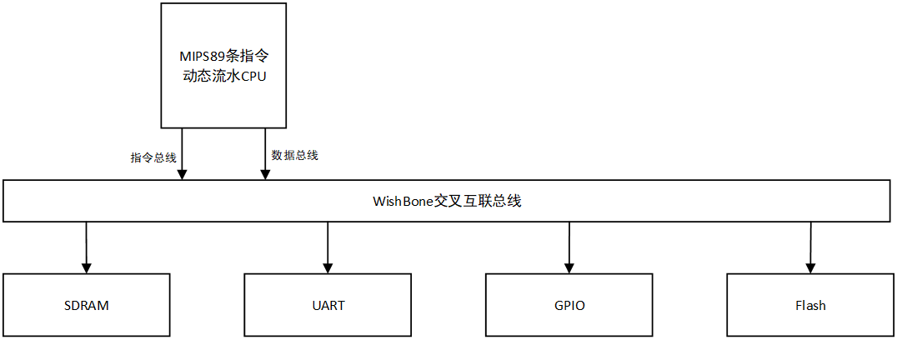
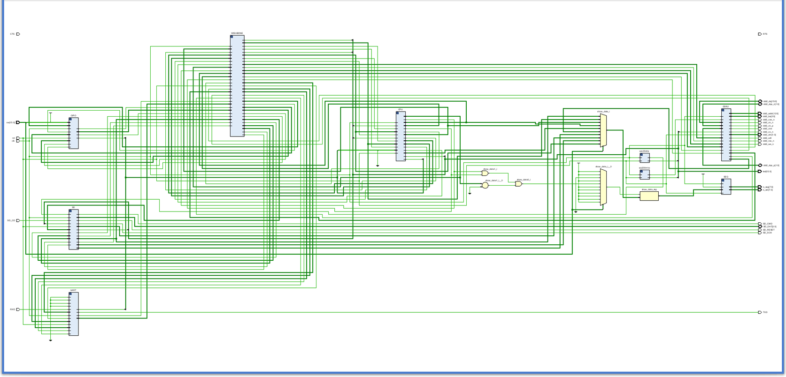
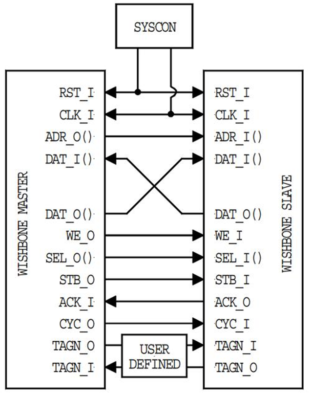
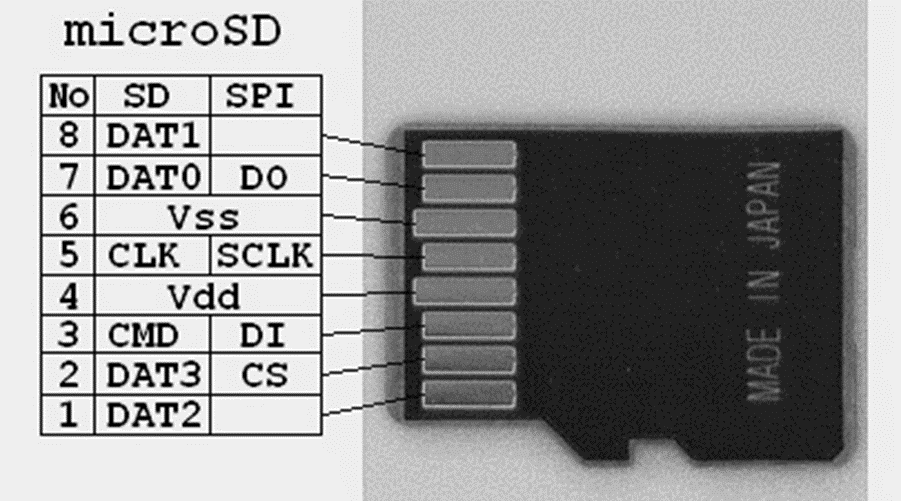
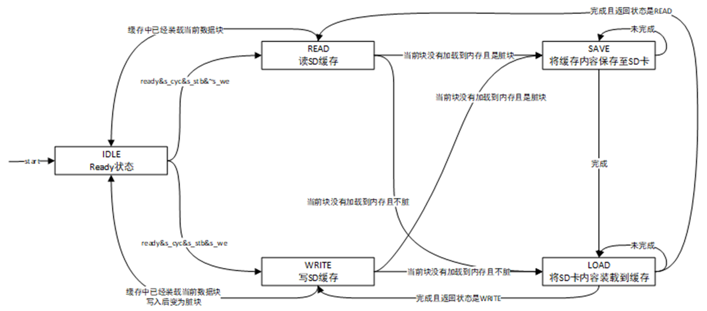
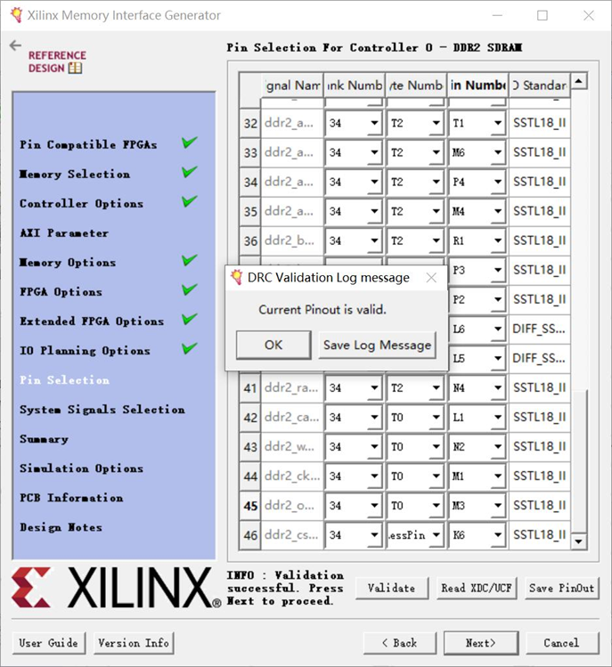
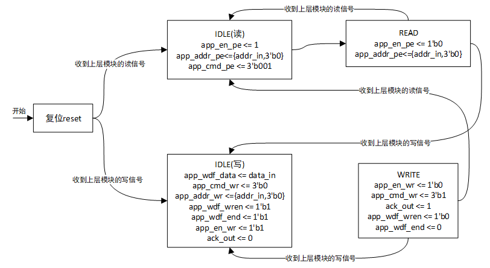
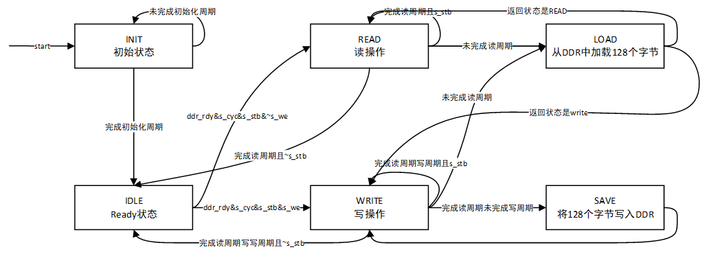
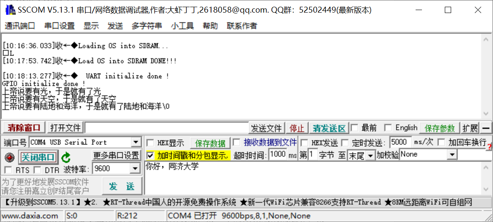

# computer-system
同济大学CS《计算机系统实验》实验二TongJi University CS computer system experiment assignment 2
## 概述

本工程为2021年同济大学计算机系计算机系统实验实验2。本实验在已有CPU上增加Wishbone 总线，GPIO、UART、Flash控制器、SDRAM控制器。利用Ubuntu上建立交叉编译环境 对μC/OS-II操作系统进行改写、编译。将编译好的μC/OS-II操作系统与boost loader程序装配，将装配好的二进制汇编代码写入到SD卡中，插入FPGA开发板中，启动开发板，观察串口通信。

## 备注:star:

这个实验做的极其极其痛苦，可能是我把时序给写乱了，整个工程非常非常非常不稳定。哪怕是在一个无关模块上作出轻微的改动也有可能导致系统运行错误。这也是为什么CPU频率这么慢的原因。如果有读者成功debug请与我联系。

最后，终于把硬件课上完了。我再也不想学硬件辣555

如果本仓库有帮助到你，就送我一颗star吧🤗

如果有问题也可以在issue提出，方便其他人参考或一起讨论😋

关于报告：readme其实就是报告的核心内容了😔，推荐参考雷思磊的《自己动手写CPU》，这本书里面有非常详细的设计内容

## 环境

### 软件环境

开发环境Vivado 2020.2

仿真环境ModelSim PE 10.4c

测试环境sscom5

编译环境VMware 16, Ubuntu, GNU 

### 硬件环境

NEXYS 4 DDR Atrix-7

SD卡，其中要拷贝loader程序和操作系统映像

## 设计

### 总体设计

#### 系统设计总框图

#### RTL分析图

### 硬件实现

#### B2规范的Wishbone交叉互联总线

在本实验中指令读写和数据读写分离因此需要有两个主机挂载在Wishbone总线上，并且还需要挂在多个从机到Wishbone总线上，所以Wishbone总线采用交叉互联的连接方式。

#### FLASH

本实验使用SPI模式，SD控制器包含一个512字节的缓存，缓存对脏数据的处理方式是写回法。

microSD模块一共经过了两级封装，第一级封装直接与microSD卡交互，完成了物理层面信号的发送与接受，第二级封装面向工程使用，加入了microSD缓存，使用状态机将SD卡的顶层接口改造成适合Wishbone总线的形式。第二次封装的Wishbone通信状态机如下：

#### SDRAM

本实验使用MIG ip核生成SDRAM的控制器。

SDRAM的控制依然是采用两级封装的方式，底层控制器用于控制MIG ip核并向上一层提供便捷的读写接口。上层控制器使用底层控制器提供的读写接口，将读写时序改造为适应wishbone总线的形式。两个封装模块都以状态机的形式实现。

- SDRAM signal controller

  

- SDRAM function controller

  

#### GPIO

直接使用OpenCores站点下提供的GPIO源代码即可。GPIO的外部输入是FPAG开发板的拨码卡关，外部输出是七段数码管。其他所有接口均是内部的，移植过程中只要将GPIO连接到WishBone总线上即可。

在实际测试中发现GPIO对于μC/OS-II操作系统的意义不大，此处不显示GPIO的外部输出，让七段数码管显示CPU的PC寄存器，对于CPU的运行状态能够更好的显示。

#### UART

UART控制器依然直接使用OpenCores站点下提供的UART源代码即可。UART需要配置两个管脚约束分别是串口输出TXD和串口输入RXD，然后将UART控制器间接到WishBone总线上即可。

#### [89条动态流水CPU](https://github.com/lingbai-kong/MIPS89-pipeline-CPU)

本实验需要将上次实验的89条指令MIPS流水线CPU进行改造，具体改造内容如下

1. 将其接口改造为适合WishBone总线的模式，使其能够通过WishBone总线进行数据和总线的读写

2. 将pc寄存器的起始地址设置为0x30000000，使其从SD卡的0地址开始执行汇编代码

3. 将CPU模式由小端改写为大端，以适配gcc编译器

4. 取消CPU对延迟槽指令的屏蔽，让CPU执行延迟槽指令，以适配gcc编译器的优化

### 软件实现

#### boost loader

观察到该汇编代码中有许多值为1的label，为了防止错误并且增强程序的可读性，将这些label分别改为L1、L2、L3。本实验设计的串口波特率为9600，UART控制器的时钟频率为100MHZ，因此分频系数应设置为：28BH。需要boostloader汇编程序配置UART分频系数寄存器为28BH。

#### μC/OS-II

本实验设计的串口波特率为9600，UART控制器的时钟频率为100MHZ，因此分频系数应设置为：28BH。修改内容位于openmips.h文件内需要修改系统时钟频率为100000000。因为该文件内定义了波特率为9600因此应用程序会计算出正确的分频系数。

最终得到带boostloader的μC/OS-II操作系统的二进制映像文件：OS.bin

## 实验流程

首先先将各个从机设备连接到WishBone上，暂时不引入CPU，用数码管发出主机信号，用数码管和LED灯显示WishBone响应，逐步调试。完成后再引入CPU。此时不需要立即移植操作系统，先根据《自己动手写CPU》一书让CPU执行UART测试程序和GPIO测试程序，然后再让CPU模拟操作系统的加载过程，以上测试均通过后代表移植操作系统所需的硬件环境已经搭建完成，此时再去移植操作系统，完成整个实验。

## 下板结果

1. 使用WinHex软件将操作系统的编译结果写入SD卡

2. 将SD卡插入FPAG开发板中

3. 用usb数据线连接FAGA开发板至电脑

4. 打开串口调试，设置波特率为9600bps、8位数据位、没有奇偶校验位、1位停止位

5. 将bit流下板，观察串口通信

通信结果如下图所示：

## 结果分析

由上图可知，CPU启动后首先执行boostloader程序，将SD卡内的操作系统加载至SDRAM，开始加载时FPGA发送字符串“Loading OS into SDRAM…”。等待77秒后加载操作系统完成。此时FPGA发送字符串“Load OS into SDRAM DONE!!!”。之后操作系统开始初始化，等待20秒后操作系统初始化完成，开始执行应用程序进程，应用程序进程首先开始初始化UART和GPIO，分别发送字符串“UART initialize done !”和“GPIO initialize done ！”。然后开始执行程序的主要功能即发送中文字符串“上帝说要有光，于是就有了光\n上帝说要有天空，于是就有了天空\n上帝说要有陆地和海洋，于是就有了陆地和海洋\0”。发送完毕后操作系统进入等待状态。上述结果与期望结果相一致，说明实验成功。

## 其他仓库推荐

1. [89条MIPS指令的多周期CPU](https://github.com/lingbai-kong/MIPS89-pipeline-CPU)
2. [54条MIPS指令的多周期CPU](https://github.com/lingbai-kong/MIPS54-multicycle-CPU)

